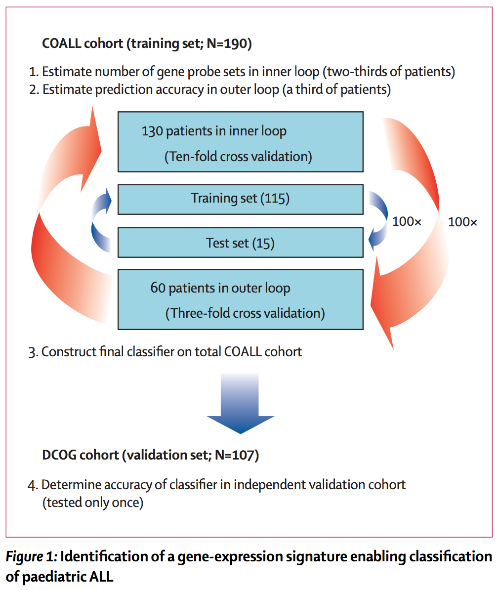
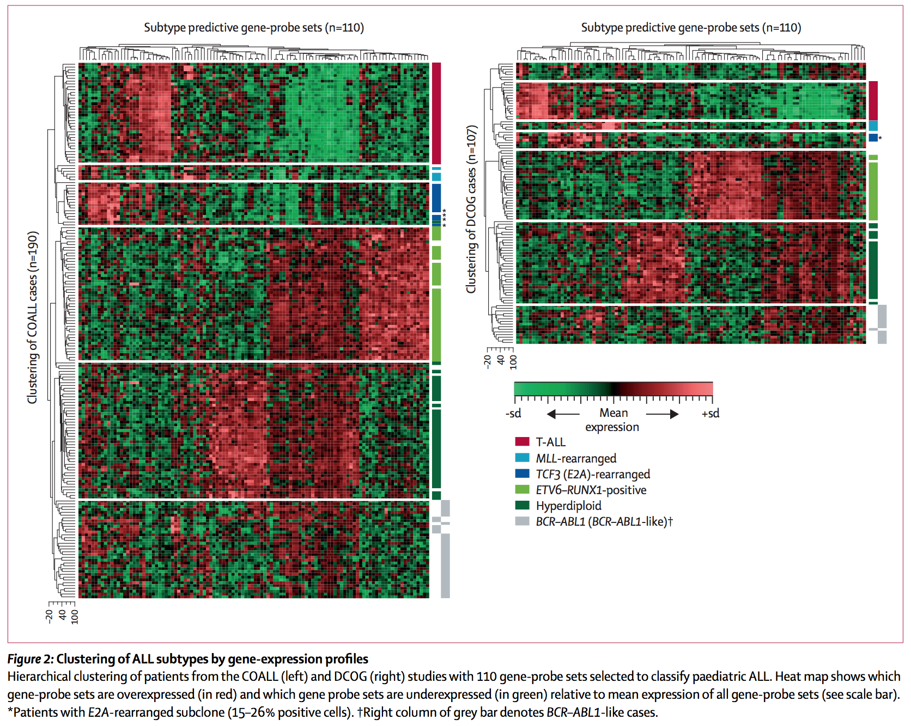
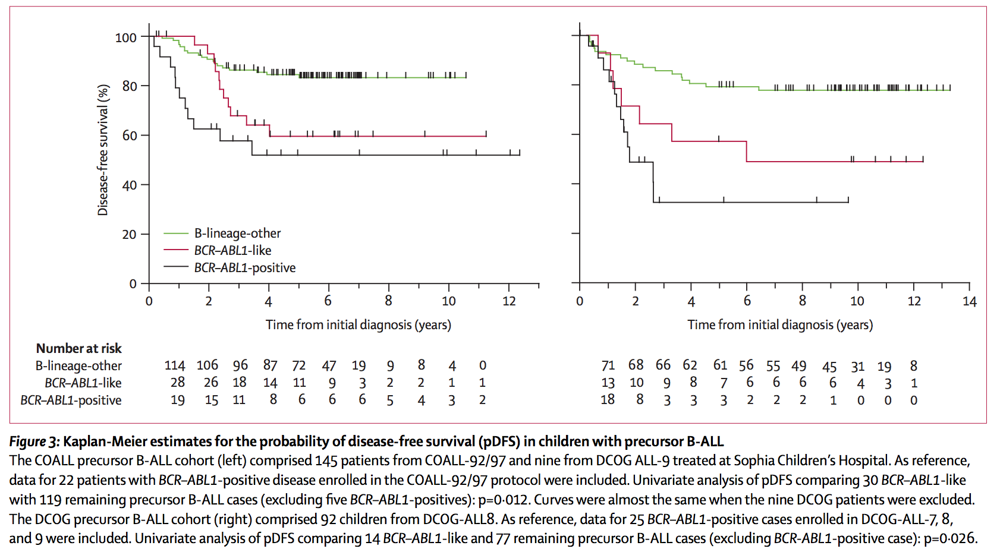

```{r include=FALSE, echo=FALSE, eval=TRUE}
library(knitr)
options(width=300)
knitr::opts_chunk$set(
  fig.width = 7, fig.height = 5, 
  fig.path='figures',
  fig.align = "center", 
  size = "tiny", 
  echo = FALSE, eval=TRUE, 
  warning = FALSE, message = FALSE, 
  results = TRUE, comment = "")
# knitr::asis_output("\\footnotesize")

```

## Identification of signatures for subtypes of leukemia

```{r denboer_procedure, out.height="40%", out.width="40%", fig.cap="Figure 1 from Den Boer et al. (2009). "}
 
```

## Hierarchical clustering of genes and samples

```{r denboer_hclust, out.height="70%", out.width="70%", fig.cap="Figure 2 from Den Boer et al. (2009). "}
 
```

## Survival curves


```{r denboer_survival, out.height="80%", out.width="80%", fig.cap="Figure 3 from Den Boer et al. (2009). "}
 
```


