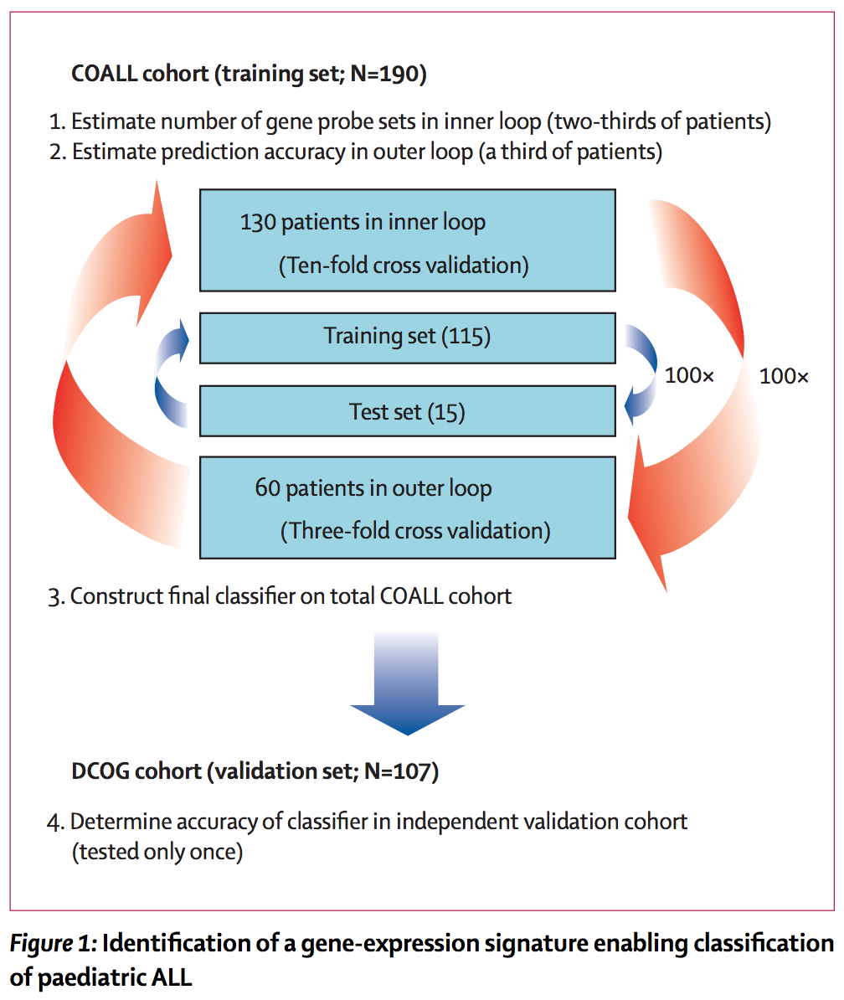

## Study case

We present here a dataset that will be used as study case to apply different approaches of multivariate analysis:

- data exploration
- multidimensional scaling
- differential analysis
- clustering (unsupervised classification)
- supervised classification

**Reference:** Den Boer ML *et al.* (2009). A subtype of childhood acute lymphoblastic leukaemia with poor treatment outcome: a genome-wide classification study. Lancet Oncol. 2009 10:125-34. [[doi: 10.1016/S1470-2045(08)70339-5](http://doi.org/10.1016/S1470-2045(08)70339-5)], 
[[PMID 19138562](https://www.ncbi.nlm.nih.gov/pubmed/19138562)]. Data available at Gene Expression Omnibus, series [[GSE13425](https://www.ncbi.nlm.nih.gov/geo/query/acc.cgi?acc=GSE13425)]

## Identification of signatures for subtypes of leukemia

Figure 1 from Den Boer et al. (2009). 

## Hierarchical clustering of genes and samples

Figure 2 from Den Boer et al. (2009). 

## Survival curves

Figure 3 from Den Boer et al. (2009). 

