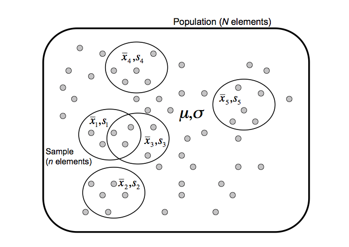

```{r include=FALSE, echo=FALSE, eval=TRUE}
library(knitr)

options(width=300)
knitr::opts_chunk$set(
  fig.width = 7, fig.height = 5, 
  fig.align = "center", 
  fig.path = "figures/sampling-estimation_",
  size = "tiny", 
  echo = FALSE, eval=TRUE, 
  warning = FALSE, message = FALSE, 
  results = TRUE, comment = "")
# knitr::asis_output("\\footnotesize")

dir.main <- "~/stat1"
dir.slides <- file.path(dir.main, "slides")
setwd(dir.slides)
```

# Eléments de théorie

## Population et échantillon

On s'intéresse généralement à des propriétés d'une population (finie ou infinie) qu'il est impossible de couvrir de façon exhaustive (coût, temps, mesures destructives). 

On prélève un **échantillon**, sur lequel on peut mesurer des **paramètres** (moyenne, écart-type). 

On **estime** les paramètres de la population ($\mu$, $\sigma$) à partir des paramètres d'échantillon ($\bar{x}$, $s$). 

## Population et échantillon


<!-- ```{r one_sample, fig.height=3, fig.cap="Sélection d'un échantillon dans une population. "} -->
<!-- include_graphics("figures/population_one_sample.pdf") -->
<!-- ``` -->

## Population et échantillons

**Problème général de l'estimation**: si l'on avait choisi un autre échantillon, on disposerait de paramètres différents. Dès lors, comment évaluer la fiabilité de nos estimateurs ?




<!-- ```{r some_samples, fig.height=3, fig.cap="Sélection d'un échantillon dans une population. "} -->
<!-- include_graphics("figures/population_some_samples.pdf") -->
<!-- ``` -->

## Exemple historique: génome de la levure

```{r load_yeast_gene_lengths}
## Read a GTF file
## Format specification: http://www.ensembl.org/info/website/upload/gff.html
gtf.file <- "../data/Saccharomyces_cerevisiae/Saccharomyces_cerevisiae.R64-1-1.37.gtf"
features <- read.delim(gtf.file, comment.char = "#", sep="\t", header=FALSE, row.names=NULL)
names(features) <- c("seqname", "source", "feature", "start", "end", "score", "strand", "frame", "attribute")
# nrow(features) ## Count feature number

## Select subset of features having "gene" as "feature" attribute
genes <- subset(features, feature=="gene")
## nrow(genes) ## Count the number of genes

```
- 1992: publication du premier chromosome eucaryote complet, le 3ème chromosome de la levure. 
- 1996: publication du génome complet.

Sur base des gènes dU 3ème chromosome (échantillon) on peut estimer la taille moyenne d'un gène de levure. 

**Questions: ** 

(a) La moyenne d'échantillon (chromosome III) permettait-elle de prédire la moyenne de la population (génome complet) ?

(b) Cet échantillon peut-il être qualifié de "simple et indépendant" ?

## Distribution des tailles de gènes

```{r gene_length_histo, fig.width=5, fig.height=6, fig.cap="Distribution of gene lengths for Saccharomyces cerevisiae. "}
par.ori <- par(no.readonly = TRUE)
par(mar = c(4.1,4.1,2.1,1.1))

## Add a column to the table with gene lengths
genes$length <- genes$end - genes$start +1
max.len <- max(genes$length)

## Select genes on the third chromosome
genes.III <- subset(genes, seqname == "III")
# View(genes.III)
par(mfrow=c(2,1))

## Plot an histogram with gene lengths
hist(genes.III$length, 
     breaks=seq(from=0, to=max.len+100, by=100), 
     main="Chromosome III",
     xlab=NA, ylab="Number of genes", 
     col="#BBDDFF")

## Plot an histogram with gene lengths
hist(genes$length, 
     breaks=seq(from=0, to=max.len+100, by=100), 
     main="Full genome",
     xlab="Gene length (bp)", ylab="Number of genes", 
     col="#BBFFDD")
par(mfrow=c(1,1))

par <- par.ori

```

## Exemples actuels

Dans chaque cas, définissez la ou les populations, et posez-vous les questions concernant la validité de l'échantillonnage (simple, indépendant, représentatif, ...).


- Profils transcriptomiques de patients: 40 cas de leucémie myéloide aigue (AML) et 40 cas de leucémie lymphoblasique eaigue (ALL). 

- Etude d'association à échelle génomique: SNPs de 2000 cas (diabète de type 2) et 3000 contrôles (pas de diabète. 


## Paramètres de population

Par convention, nous utiliserons les symboles suivants pour les paramètres calculés sur la **population entière**. 

| Paramètre | Formule |
|-----------|-------------|
| Taille (nombre d'individus) | $N$ |
| Variable mesurée | $X = \left
| Moyenne  | $\mu = \frac{1}{N}\sum_{i=1}^{N} x_i$ |
| Variance | $\sigma^2 = \frac{1}{N}\sum_{i=1}^{N} (x_i - \mu)^2$ |
| Ecart-type | $\sigma = \sqrt{\sigma^2}$ |

## Paramètres d'échantillons

Par convention, nous utiliserons les symboles suivants pour les paramètres calculés sur un **échantillon**. 

| Paramètre | Formule |
|-----------|-------------|
| Effectif (nombre d'individus) | $n$ |
| Moyenne | $\bar{x} = \frac{1}{n}\sum_{i=1}^{n} x_i$ |
| Variance | $s^2 = \frac{1}{n}\sum_{i=1}^{n} (x_i - \bar{x})^2$ |
| Ecart-type | $s = \sqrt{s^2}$ |

La barre au-dessus d'un symbole de variable dénote la moyenne. 


# Démo-cours

## Jeux de données simulés

Avant d'analyser les données réelles, jouons avec des jeux de données générés selon un modèle probabilise donné. Nous conrôlons ainsi tous les paramètres, et pouvons évaluer la fiabilité des estimateurs. 

## Moyennes d'échantillons

```{r rand_norm}
N <- 10000 ## Population size
mu0 <- 0 ## Mean for the random generator
sigma0 <- 1 ## Standard deviation for the random generator

## Generate the population
x <- rnorm(n=N, mean = mu0, sd = sigma0)

## Check the population mean

## Compute population mean and standard deviation
mu <- mean(x)

## Note: sd() computes a sample-based estimate of the population mean. Since we dispose here of the whole population, we "undo" the sampling correction (N-1). 
sigma <- sd(x) * (N-1)/N 


```

```{r mean_sampling}
## Select random samples and compute their means
n <- 16 ## Sample size
R <- 10000 ## Repetitions of the sampling
sample.means <- replicate(
  n = R, 
  mean(sample(x, size = n, replace = FALSE)))

## Compute the mean and standard deviation of the sample means
m <- mean(sample.means)
s <- sd(sample.means) * (n-1) / n
```

On prélève un échantillon d'effectif  $n=`r n`$ (nombre d'éléments) dans une population de taille $N=`r N`$. 

La population suit une distribution gaussienne de moyenne $\mu=`r mu`$ et d'écart-type $\sigma=`r sigma`$.

Répétons l'échantillonnage un grand nombre de fois ($R = `r R`$). Pour chaque échantillon, calculons la moyenne, et étudions la distribution de ces moyennes. 

## Distribution d'échantillonnage de la moyenne

```{r rand_norm_sampling_mean, fig.width=7, fig.height=6, fig.cap="Distribution des moyennes d'échantillon"}

## Compute the range and breaks of the histogram, with a symmetric display
xlim <- ceiling(max(abs(range(x)))) 
xbreaks <- seq(from=-xlim, to=xlim, by=0.1)

par(mfrow=c(2,1))
par(mar=c(4.1,4.1,2.1,1.1))
## Distribution of the population
hist(x, breaks=xbreaks, xlab = NA,
     col="#BBFFDD", main="Population", las=1)
legend("topright", cex=0.8,
       c(
  paste(sep="", "N = ", round(digits=3, N)), 
  paste(sep="", "mu = ", round(digits=3, mu)), 
  paste(sep="", "sigma = ", round(digits=3, sigma))
))

## Distribution of sample means
hist(sample.means, breaks=xbreaks, xlab="x",
     col="#BBDDFF", main="Samples", las=1)

legend("topright", cex=0.8,
       c(
  paste(sep="", "n (sample size) = ", round(digits=3, n)), 
  paste(sep="", "R (replicates) = ", round(digits=3, R)), 
  paste(sep="", "m (mean of the means) = ", round(digits=3, m)), 
  paste(sep="", "s (sd of the means) = ", round(digits=3, s))
))

par(mfrow=c(1,1))
```

## Espérance de la moyenne d'échantillon


**Non biaisée**: l'espérance de la moyenne d'échantillon est égale à la moyenne d'échantillon: si on prélèvait un nombre infini d'échantillons  et qu'on calculait leurs moyennes ($\bar{X}$), la moyenne de ces moyennes  de la population ($\mu$).

$<\bar{X}> = \mu$

## Variance de la moyenne d'échantillon

**Dispersion: ** la variance de la moyenne d'échantillon diminue avec l'effectif. 

$\sigma^2_{\bar{X}} = \frac{\sigma}{n}$

$\sigma_{\bar{X}} = \sqrt{\frac{\sigma}{n}}$

## Convergence

- Quand la taille de l'échantillon augmente, la moyenne d'échantillon ($\bar{X}$) converge vers la moyenne de la population ($\mu$). 

- Cette convergence est d'autant plus rapide que l'effectif ($n$) est grand. 

- L'imprécision (qu'on peut mesurer par l'écart-type) diminue avec la racine carrée de l'effectif.  

- En pratique, ceci signifie que *si l'on veut doubler la précision d'une estimation de moyenne, il faut quadrupler la taille d'échantillon* !

## Distribution normale

Egalement appelée **distribution gaussienne**.

**Densité de probabilité**: 

$$f(x) = \frac{1}{\sigma\sqrt{2\pi}} e^{-\frac{1}{2}(\frac{x - \mu}{\sigma})^2}$$

** Distribution normale standard**

La distribution normale standard $\mathcal{N}(1,0)$ est une normale de moyenne $\mu=0$ et d'écart-type $\sigma=1$.

**Standardisation**


## Théorème central limite

La somme de variables aléatoires indépendantes et identiquement distribuées tend vers une distribution gaussienne.

**Démo au cours**

## Variance d'échantillon

Variance d'échantillon.

$$s^2 = \frac{1}{n}\sum_{i=1}^{n} (x_i - \bar{x})^2$$
La variance d'échantillon constitue-t-elle un bon estimateur de la variance de la population ? **Non**. Pourquoi ?

## Biais de la variance d'échantillon

L'espérance de la variance d'échantillon diffère de la variance de la population. 

$$<s^2> = \sigma^2 \cdot \frac{n-1}{n} \lt \sigma^2$$

$s$ est un estimateur **biaisé** de $\sigma$: 

- la variance d'échantillon sous-estime systématiquement la variance de la population;

- le biais est d'autant plus important que l'effectif est fiable.

## Estimation non-biaisée de la variance

Pour estimer la variance de la population, on effectue une correction du biais mentionné. 

$$\hat{\sigma^2} = \frac{n}{n-1} s^2 = \frac{1}{n-1}\sum_{i=1}^{n} (x_i - \bar{x})^2$$


## Intervalle de confiance autour de la moyenne

On dispose d'une moyenne d'échantillon $\bar{x}$.

On ignore la moyenne de population $\mu$, mais on saite que la distribution de moyennes d'échantillon prélevés dans cette population suit une certaine distribution. 

Sur cette base, on peut calculer un **intervalle de confiance**, qui est limité par les valeurs au-delà desquelles, si $\mu$ s'y trouvait, la probabilité d'obtenir la moyenne observée serait inférieure à une probabilité $\alpha$ donnée (exemple: $\alpha = 0.05$). 

**Niveau de confiance:** $1 - \alpha$ (exemple: $1-\alpha= 0.95$).


## Distribution de Student

**Démo:** forme de la distribution de Student en fonction de $\nu$. 

```{r student_distrib, fig.width=7, fig.height=4, firg.cap="Distribution de Student. "}
## ##############################################################
##
## Draw a series of Student distributions with various degrees of
## freedom
##
## Author: Jacques van Helden
##
## Running this script requires to first run the script config.R
##
## Single-command execution:
## source(file.path(dir.R.files, 'student.R'))
##
## NOTE: THIS SCRIPT IS PROBABLY PARTLY REDUNDANT WITH
## golub/t-test_golub.R, BUT THERE ARE INTERESTING PLOTS HERE. TO
## CHECK.

x <- seq(from = -5, to=5, by=0.01)

in.colors <- TRUE ## Activate this to generate the color drawing for the book cover
freedom <- c(30,10,5,2,1)

if (in.colors) {
  palette <-   rainbow(10)
  bg <- '#000000'
  fg <- '#FFFFFF'
  file.prefix <- "student_distrib_cover"
} else {
  palette <- gray((0:16)/16)
  bg <- '#FFFFFF'
  fg <- '#000000'
  file.prefix <- "student_distrib"
}
# lty <- c(1,6,5,4,2,3,1,6,5,4,2,3)
lty <- rep(1, length.out = 12)

par(bg=bg)
par(fg=fg)

i <- 1
plot(x,dnorm(x),
     type="l",
     col=palette[i],
     lwd=2,
     lty=1,
     main="Student distributions",
     panel.first=grid(),
     xlab="x",
     ylab="density",
     col.axis=fg,
     col.lab=fg
     )
for (n in freedom) {
  i <- i+1
  lines(x,dt(x,n),
        type="l",
        col=palette[i],
        lwd=2,
        lty=lty[i]
        )
}

legend("topright",
       legend=c("normal",paste("student, df=",freedom)),
       col=palette[1:(length(freedom)+1)],
       lty=lty,
       lwd=2,
       bty="o",
       bg=bg)


```


# Exercices
