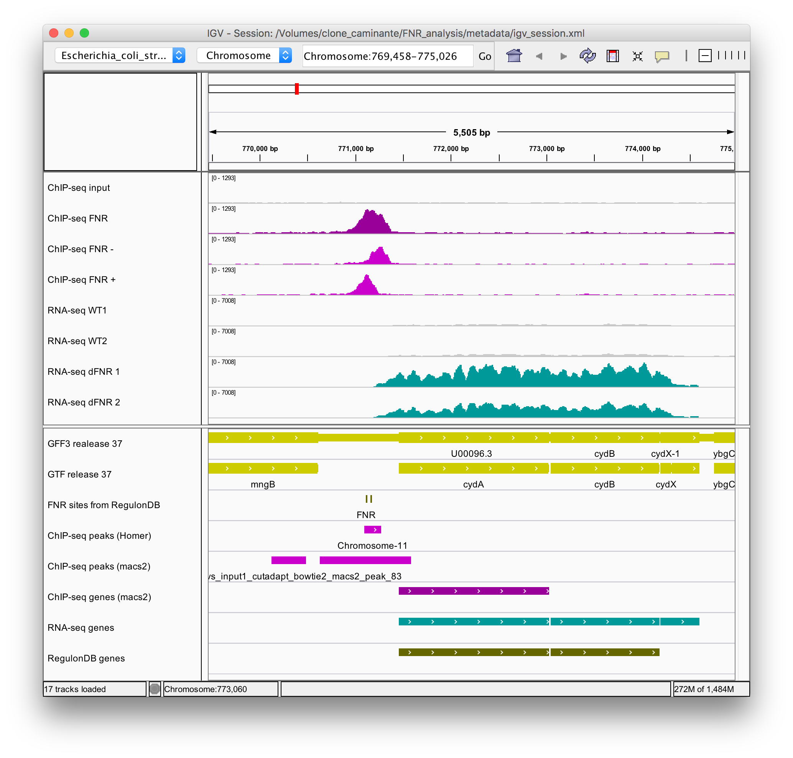

```{r include=FALSE, echo=FALSE, eval=TRUE}
library(knitr)

options(width = 300)
# options(encoding = 'UTF-8')
knitr::opts_chunk$set(
  fig.width = 7, fig.height = 5, 
  fig.path = 'figures/07_tests_multiples',
  fig.align = "center", 
  size = "tiny", 
  echo = FALSE, eval = TRUE, 
  warning = FALSE, message = FALSE, 
  results = TRUE, comment = "")

options(scipen = 12) ## Max number of digits for non-scientific notation
# knitr::asis_output("\\footnotesize")

```


## What is a P value?

There are [hundreds of published articles](https://www.ncbi.nlm.nih.gov/pubmed?term=p-value%5BTitle%5D) arguing about the correct use, misinterpretation and misuse of the P value. 

In 2016, the American Statistical Association published an article to address the question of good use and misuse of thresholds on the P value. 


*"Informally, a p-value is the probability under a specified statistical model that a statistical summary of the data (e.g., the sample mean difference between two compared groups) would be equal to or more extreme than its observed value."*

Source: [The ASA's Statement on p-Values: Context, Process, and Purpose (2016)](https://amstat.tandfonline.com/doi/full/10.1080/00031305.2016.1154108#.W_T1Hv5Kh24)


*"De manière informelle, la probabilité critique ("P valeur") est la probabilité, étant donné un modèle statistique, qu'une statistique qui décrit les données (par exemple la différence de moyenne entre deux groupes comparés) soit égale ou plus extrême que la valeur observée."*"


## What is the right threshold on P value?

- Q: Why do so many colleges and grad schools teach $p = 0.05$?
- A: Because that’s still what the scientific community and journal
editors use.
- Q: Why do so many people still use $p = 0.05$?
- A: Because that’s what they were taught in college or grad school

Source: [The ASA's Statement on p-Values: Context, Process, and Purpose (2016)](https://amstat.tandfonline.com/doi/full/10.1080/00031305.2016.1154108#.W_T1Hv5Kh24)

## Comment choisir un seuil pour la P-valeur ? 

- La P valeur est calculée sur une échelle continue allant de 0 à 1. 
- Elle fournit une estimation du risque de faux positif (probabilité d'obtenir sous hypothèse nulle un résulat au moins aussi extrême que celui observé). 


## Problème: occurrences de k-mères


```{r kmer_overrepresentation}
## ##############################################################
## Significance of k-mer over-representation with the binomial distribution
##
## Author: Jacques van Helden

L <- 100000 ## sequence length
k <- 8 ## motif length
x <- 6 ## Observed occurrences

## Parameters of the binomial
N <- L - k + 1 ## Number of possible positions for a k-mer
p.r <- 0.25 ## Residue probability
p.M <- p.r^k  ## Prior probability of k-mer M, assuming equiprobable nucleotides

## Expected number of occurrences;
m <- N * p.M ## Expected occurrences of the k-mer M
## print(m) 
## Answer: 1.525772

## The P-value is the right tail of the distribution, inclusive
P.val <- pbinom(x - 1, size = N, prob = p.M, lower.tail = F) 
## print(P.val)
## Answer: 0.004830556

## The E-value is the product of the P-value by the number of tests
T <- 4^k ## Number of tests
E.val <- T * P.val
## print(E.val)
## Answer: 316.5753

## -Rate (FWER): probability to osberve 
## at least one FP among all the octanucleotides.
P.noFP.one.test <- (1 - P.val)
P.noFP.all.tests <- (1 - P.val)^T
## print(P.noFP.all.tests) 
## Answer: 1.513383e-138

FWER <- 1 - (1 - P.val)^T
## print(FWER) 
## The result is printed as 1, since the first difference occurs at the 138th decimal. 

## A more suitable way to compute the FWER 
## is to use the binomial dCDF 
## to compute the probability to have at least one FP in a series of T tests
FWER <- pbinom(0, prob = P.val, size = T, lower.tail = F) 
## print(FWER)
## Answer: 1
##
## In this case it makes no difference because the FPR is too close
## from 1.
```

We counted the occurrences of all octanucleotides ($k = 8$) in a sequence of $L = `r format(digits=12, big.mark = ",", N)`$ base pairs (single strand counts). The sequence contains $x = 6$ occurrences of `GATTACCA`.

Assuming equiprobable and independent nucleotides, is this k-mer over-represented in the sequence?

## Modelling the problem

- Prior probability of the k-mer: $p = 0.25^`r k` = `r signif(digits=3,  0.25^k)`$

- Number of possible positions: $N <- L - k + 1 = `r format(digits=15, big.mark = ",", L)`- `r k`+ 1 = `r format(digits=10, big.mark = ",", N)`$

- Expected occurrences : $<X> = N \cdot p = `r format(digits=12, big.mark = ",", N)` \cdot `r signif(digits=3, p.M)`= `r signif(digits=3, m)`$

## Over-representation

We observe `r  x` occurrences of `GATTACCA`, whereas we expect `r signif(digits=3, m)`. 

Is this level of over-representation significant or is it likely to result from chance?

*Under the null hypothesis (would the sequence have been generated according to our background model), what would be the probability to observe at least `r x` occurrences?*


## Binomial p-value

Probability distribution of k-mer occurrences in a sequence of length $`r format(digits=12, big.mark=",", L)`$ according to a background model of identically and independently distributed nucleotides. 

- Left: **probability mass function** (**PMF**, **density**), i.e. the probability to observe *exactly* $x$ occurrences. Arrow: observed occurrences. 

- Right panel:  probability to observe *at least* X occurrences of the considered k-mer (note the logarithmic scale on Y). This is the **P value** of the occurrences. 

```{r fig_gattacca_binomial, fig.width=10, fig.height=4, out.width="80%"}
par.ori <- par(no.readonly = TRUE)
par(mfrow = c(1, 2))
par(mar = c(5.5, 5.5, 4.1, 0.5))
par(mgp = c(4, 1, 0))
par(las = 1)

## ##############################################################
## Plot a binomial distribution with the para)meters
x.values <- 0:10

## density plot
density <- dbinom(x.values, N, p.M)
#x.shifted <- x.values -0.5
plot(x.values, density, 
     log = '', lwd = 4, col = "darkgray",
     xlab = 'X (k-mer occurrences)', 
     ylab = "", las = 1, 
     main = 'Binomial density', type = 'h', 
     panel.first = abline(h = seq(0, 0.3, 0.05), col = "#BBBBBB"))
title(ylab = "P(X=x)", mgp = c(4, 1, 0))

lines(x.values[x.values >= x], 
      density[x.values >= x], 
      col = "red", type = "h", lwd = 4)
     
# plot(x.shifted, density, 
#      log = '', 
#      xlab = 'Number of occurrences', 
#      ylab = 'Binomial density', type = 's', 
#      panel.first = grid(col = '#BBBBBB', lty = 'solid'))
arrows(x, 0.08, x, 0.02, length = 0.15, angle = 20, code = 2, lwd = 3, col = "red")
#text(x, 0.08, labels = paste(sep = "", "P(X=6) = ", signif(digits = 2, dbinom(x, N, p.M))), pos = 3)
legend("topright", paste(sep = "", "P(X=6) = ", signif(digits = 2, dbinom(x, N, p.M))), bty = "o", bg = "white")

## dCDF plot
P.values <- pbinom(x.values - 1, N, p.M, lower.tail = F)
plot(x.values, 
     P.values, lwd = 1, las = 1, 
     log = 'y', main = "Binomial P-value", 
     xlab = 'X (k-mer occurrences)', 
     ylab = '', type = 'l', panel.first = grid(col = '#BBBBBB', lty = 'solid'))
title(ylab = "P(X >= x)", mgp = c(4, 1, 0))
points(x.values, P.values, 
       pch = 1, lwd = 2, cex = 0.7)
arrows(x, min(P.values), x, P.val, 
       col = 'red', 
       length = 0.1, angle = 15, code = 2, lwd = 3)
arrows(x, P.val, 0, P.val, 
       col = 'red', 
       length = 0.1, angle = 15, code = 2, lwd = 3)
text(2, P.val, 
     labels = paste(sep = "", "Pval=", signif(P.val, digits = 2)), 
     col = "red",
     pos = 1)
legend("topright", paste(sep = "", "P(X>=6) = ", signif(digits = 2, P.val)), bty = "o", bg = "white")

points(x.values[x.values == x], 
       P.values[x.values == x], 
       pch = 19, col = "red")

par(par.ori)

```


## P value of k-mer over-representation

In our example, the P-value is the probability under the background model (equiprobable and independent nucleotides) that the occurrences of a k-mer (`GATTACCA`) would be equal to or higher than its observed value ($x = 6$). 

We obtain the following result:

$$\begin{aligned}
P(X \ge x) &=  \sum_{i=x}^{n}{C_n^i p^i (1-p)^{n-i}} \\
  &=  \sum_{i=6}^{100,000}{C_{100,000}^i 0.25^i (1-0.25)^{100,000-i}} \\
  &= `r signif(digits=3, P.val)`
\end{aligned}
$$

## RNA-seq and ChIP-seq


```{r fig-margin, fig.margin=TRUE, out.width="40%", fig.cap="**Analyse NGS de la régulation par FNR chez *Escherichia coli***. *Haut : * Profil de couverture des reads alignés sur le génome de *E.coli* dans une expérience de ChIP-seq (pourpre), de RNA-seq chez une souche sauvage (gris) et mutante pour FNR (jade). *Bas :* gènes annotés, pics de  ChIP-seq, gènes différentiellement exprimés (RNA-seq). "}

```


## Exercice 7.1: détection de pics ChIP-seq

```{r chip_seq_peak}
G <- 4e+6 ## Genome size
N <- 1e+6 ## NGS library size
w <- 200 ## window size
x <- 70 ## Reads over the considered genomic window


T <- G / w ## Number of genomic windows  
x.exp <- N / T ## Expected reads per window


## P-value
P <- ppois(q = x - 1, lambda = x.exp, lower.tail = FALSE)
E <- P * T ## E-value


```


Lors d'une expérience de ChIP-seq on a aligné $N = `r format(digits=12, big.mark=".", N)`$  lectures sur un génome de $G =  `r format(digits=12, big.mark=".", G)`$ paries de bases. Sur une région génomique donnée de $w = `r w`$ pb, on trouve $x=`r x`$ fragments de lecture. Peut-on considérer que cette région est significativement enrichie ? 

a. Quel serait le nombre attendu de lectures attendu a priori sur une région de cette largeur ?
b. Choisissez une distribution pour modéliser ce problème en justifiand votre choix.
c. Indiquez la formule de la P-valeur, puis remplacez les symboles par les valeurs numériques (Le résultat du calcul sera fourni pendant le cours). 
e. Si l'on place un seuil $\alpha = 0.05$ et qu'on analyse de la même façon toutes les fenêtres génomiques non-chevauchantes de 200bp, combien de faux-positifs s'attend-on à trouver ?

# Tests multiples

## Quelques exemples de tests multiples

| Application | Nombre typique de tests|
|-----------------------------------------------|:-----------------:|
| RNA-seq: détection de gènes différentiellement exprimés  | `r format(digits=12, big.mark = ".", 25000)` gènes |
| Détection de pics dans des données de ChIP-seq | `r format(digits=12, big.mark = ".", 1e7)` régions |
| Découverte de k-mères sur- ou sous-représentés dans les séquences régulatrices | `r 4^6` 6-mères, `r 4^7` 7-mères, `r 4^8` 8-mères |
| Etude d'association à échelle génomique | `r format(digits=12, big.mark=".", 1e+6)` SNPs | 
| recherche de similarité de séquences avec BLAST | `r format(digits=12, big.mark = ".", 1e9)` |


```{r alpha}
alpha <- 0.05
```

***Question:** si on admet un seuil de $`r 100*alpha`\%$ de faux-positifs sur chaque tests, quel est le **nombre de faux-positifs** attendus ?*

## Nombre de faux-positifs attendus

La ***E-valeur*** ($E$, ***E-value***, expectation) est le nombre attendu de faux-positifs lorsqu'on effectue une série de tests avec un seuil donné sur la probabilité critique ($P$). 

Elle est obtenue en multipliant la probabilité critique ($P$) par nombre de tests ($T$).

$$E = P \cdot T$$

## Nombre de faux-positifs attendus : exemples

Nombre de faux-positif attendus pour  $\alpha = `r alpha`$. 

| Application | Nombre typique de tests | E-valeur |
|-----------------------------------------------|:-----------------:|----------:|
| RNA-seq: détection de gènes différentiellement exprimés  | 25.000 gènes | `r 25000 * alpha` |
| Détection de pics dans des données de ChIP-seq | `r format(digits=12, big.mark = ".", 1e7)` régions | `r format(digits=12, big.mark=".", 1e7 * alpha)` |
| Découverte de k-mères sur- ou sous-représentés dans les séquences régulatrices | `r 4^6` 6-mères, `r 4^7` 7-mères, `r 4^8` 8-mères | `r 4^8 * alpha` |
| Etude d'association à échelle génomique | `r format(digits=12, big.mark=".", 1e+6)` SNPs | `r format(digits=12, big.mark=".", 1e6 * alpha)` |
| recherche de similarité de séquences avec BLAST | `r format(digits=6, 1e9, big.mark = ".")` |`r format(digits=12, big.mark=".", 1e9 * alpha)` |


## Tableau de contingence

Dans un problème de prédiction ou de classification, on  peut dresser un tableau de contingence indiquant la correspondance entre le statut réel de chaque test (sous hypothèse nulle $H_0$ ou alternative $H_1$) et le résultat du test (positif ou négatif). 

|  Statut réel |    | $H_0$ | $H_1$ |
|------------ |-------------|:--------:|:--------:|
| Test | +  | $FP$ | $TP$ |
|      | -  | $TN$ | $FN$ |

$FP$: False Positive; $TP$: True Positive; $TN$: True negative; $FN$: False Negative.

